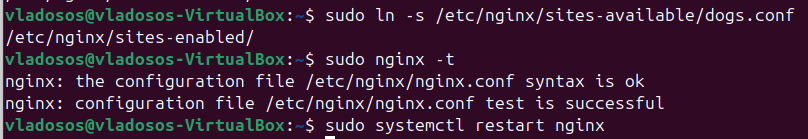

# Лабораторная работа №1
Выполнил студент Зюзин Владислав Александрович К3220
## Задания:

Настроить nginx по заданному тз:
1. Должен работать по https c сертификатом
2. Настроить принудительное перенаправление HTTP-запросов (порт 80) на HTTPS (порт 443) для обеспечения безопасного соединения.
3. Использовать alias для создания псевдонимов путей к файлам или каталогам на сервере.
4. Настроить виртуальные хосты для обслуживания нескольких доменных имен на одном сервере.

## Подготовка к работе, траблы в начале
Перед началом уточню, работа происходмла на ядре ОС Linux **`Ubuntu 24.04 LTS`**. 

* Открываем терминал и при помощи команды
  ```
  sudo apt-get install nginx
  ```
  устанавливаем NGINX.  
* Если нас просят продолжить - соглашаемся.  
* NGINX установлен!  
* После установки проверяем статус работы NGINX при помощи команды
  ```
  sudo systemctl status nginx
  ```

**Есть важное уточнение** если вы рискнули здоровьем и когда-либо раньше пытались работать с nginx-ом, то у вас может возникнуть такая проблема: 


### Шаги и решения для преодоления этой преграды: 
1. Скорее всего у вас нет конфига, мб вы его случайно удалили, как в моём случае. Для этого нужно ввести в терминал код:
   ```
   ls -l /etc/nginx/nginx.conf
   ```
    Если линукс не находит файла и каталога, то читаем далее
3. Для профилактики этой проблемы тренируем свои кривые руки и внимание :)
4. После этого пишем код 
```
sudo apt-get remove --purge nginx nginx-common nginx-core
```
он снесёт nginx, применяйте его в том случае, если у вас нет важных проектов.
6. Далее: заново скачиваем nginx с помощью кода - 
```
sudo apt-get install nginx
```
7. Вводим
   ```
   sudo nginx -t
   ```
    - так мы проверим корректен ли синтакис и сам конфиг, если видим, что тексты пройдены и конфиг succesful - тогда испытываем радость
9. ```
    sudo systemctl start nginx
   ```
    этим кодом закпускаем nginx
11. ```
    sudo systemctl status nginx
    ```
     - проверяем статус работы. Если всё горит зелёным и статус активен, то проблема решена

### Проверка работы nginx 
1. Для того, чтобы понять, что более косков допущено не было нам нужно узнать работает ли ваш nginx в браузере.
2. Вводим код
   ```
   hostname -I
   ```
   , чтобы узнать свой локальный IP адрес, в моём случае - это первые 4 значения.
5. Вводим эти занчения в браузер, успех будет достигнут, если вы увидете следующее: 


## Создание директроий для сайтов

Мы не сможем настроить виртуальные хосты, если у нас не будет пет проектов, поэтому создаём 2 директории под 2 маленьких сайта.
### Мои сайты
1. Мною была создана первая директория под 1-й сайт:
```
sudo mkdir -p /var/www/cats/html
```
2. И вторая директория, соответсвенно, под 2-й сайт:
```
sudo mkdir -p /var/www/dogs/html
```
### Создаём файлики index.html для каждого сайта:
Для котов вводим код, открывающий редактор nano:
```
sudo nano /var/www/cats/html/index.html
```
добавим код на html:
```
<html>
    <head>
        <title>Welcome to Cats World!</title>
    </head>
    <body>
        <h1>Hello, Cats!</h1>
    </body>
</html>
```
Для собак введём код, открывающий редактор: 
```
sudo nano /var/www/dogs/html/index.html
```
код на html:
```
<html>
    <head>
        <title>Welcome to Dogs World!</title>
    </head>
    <body>
        <h1>Hello, Dogs!</h1>
    </body>
</html>
```
## Настройка виртуальных хостов

**Хост** - это штука, которая связывает несколько доменов на одном сервере. В нашем случае - это `cats.local` и `dogs.local`.
Для того, чтобы наши домены слушались сначала порт 80 нам потребуется создать и расписать конфигурационные файлы (штуки, которые содержат настройки параметра системы).
###  Создадим конфигурационные файлы
* Для cats.local:
```
sudo nano /etc/nginx/sites-available/cats.conf
```
* Введём код:
```
server {
    listen 80;
    server_name cats.local;

    root /var/www/cats/html;
    index index.html;

    location / {
        try_files $uri $uri/ =404;
    }
}
```
* Для dogs.local:
```
sudo nano /etc/nginx/sites-available/dogs.conf
```
* Вставим следующий код:
```
server {
    listen 80;
    server_name dogs.local;

    root /var/www/dogs/html;
    index index.html;

    location / {
        try_files $uri $uri/ =404;
    }
}
```
### Активируем конфигурацию
```
sudo ln -s /etc/nginx/sites-available/cats.conf /etc/nginx/sites-enabled/
sudo ln -s /etc/nginx/sites-available/dogs.conf /etc/nginx/sites-enabled/
```
### Проверяем конфигурацию
* Введём код для проверки: 
```
sudo nginx -t
```
Если всё будет нормально, то вы увидите ту же напись в терминале, что и у меня.



тогда нужно перезапустить nginx
```
sudo systemctl restart nginx
```
