# Лабораторная работа №1
Выполнил студент Зюзин Владислав Александрович К3220
## Задания:

Настроить nginx по заданному тз:
1. Должен работать по https c сертификатом
2. Настроить принудительное перенаправление HTTP-запросов (порт 80) на HTTPS (порт 443) для обеспечения безопасного соединения.
3. Использовать alias для создания псевдонимов путей к файлам или каталогам на сервере.
4. Настроить виртуальные хосты для обслуживания нескольких доменных имен на одном сервере.

## Подготовка к работе, траблы в начале
Перед началом уточню, работа происходмла на ядре ОС Linux **`Ubuntu 24.04 LTS`**. 

* Открываем терминал и при помощи команды
  ```
  sudo apt-get install nginx
  ```
  устанавливаем NGINX.  
* Если нас просят продолжить - соглашаемся.  
* NGINX установлен!  
* После установки проверяем статус работы NGINX при помощи команды
  ```
  sudo systemctl status nginx
  ```

**Есть важное уточнение** если вы рискнули здоровьем и когда-либо раньше пытались работать с nginx-ом, то у вас может возникнуть такая проблема: 


### Шаги и решения для преодоления этой преграды: 
* Скорее всего у вас нет конфига, мб вы его случайно удалили, как в моём случае. Для этого нужно ввести в терминал код:
   ```
   ls -l /etc/nginx/nginx.conf
   ```
    Если линукс не находит файла и каталога, то читаем далее
* Для профилактики этой проблемы тренируем свои кривые руки и внимание :)
* После этого пишем код 
```
sudo apt-get remove --purge nginx nginx-common nginx-core
```
он снесёт nginx, применяйте его в том случае, если у вас нет важных проектов.

* Далее: заново скачиваем nginx с помощью кода - 
```
sudo apt-get install nginx
```
* Вводим
```
sudo nginx -t
```
так мы проверим корректен ли синтакис и сам конфиг, если видим, что тексты пройдены и конфиг succesful - тогда испытываем радость
```
sudo systemctl start nginx
```
этим кодом закпускаем nginx
```
sudo systemctl status nginx
```
- проверяем статус работы. Если всё горит зелёным и статус активен, то проблема решена

### Проверка работы nginx 
1. Для того, чтобы понять, что более косков допущено не было нам нужно узнать работает ли ваш nginx в браузере.
2. Вводим код
   ```
   hostname -I
   ```
   , чтобы узнать свой локальный IP адрес, в моём случае - это первые 4 значения.
5. Вводим эти занчения в браузер, успех будет достигнут, если вы увидете следующее: 


## Создание директроий для сайтов

Мы не сможем настроить виртуальные хосты, если у нас не будет пет проектов, поэтому создаём 2 директории под 2 маленьких сайта.
### Мои сайты
1. Мною была создана первая директория под 1-й сайт:
```
sudo mkdir -p /var/www/cats/html
```
2. И вторая директория, соответсвенно, под 2-й сайт:
```
sudo mkdir -p /var/www/dogs/html
```
### Создаём файлики index.html для каждого сайта:
Для котов вводим код, открывающий редактор nano:
```
sudo nano /var/www/cats/html/index.html
```
добавим код на html:
```
<html>
    <head>
        <title>Welcome to Cats World!</title>
    </head>
    <body>
        <h1>Hello, Cats!</h1>
    </body>
</html>
```
Для собак введём код, открывающий редактор: 
```
sudo nano /var/www/dogs/html/index.html
```
код на html:
```
<html>
    <head>
        <title>Welcome to Dogs World!</title>
    </head>
    <body>
        <h1>Hello, Dogs!</h1>
    </body>
</html>
```
## Настройка виртуальных хостов

**Хост** - это штука, которая связывает несколько доменов на одном сервере. В нашем случае - это `cats.local` и `dogs.local`.
Для того, чтобы наши домены слушались сначала порт 80 нам потребуется создать и расписать конфигурационные файлы (штуки, которые содержат настройки параметра системы).
###  Создадим конфигурационные файлы
* Для cats.local:
```
sudo nano /etc/nginx/sites-available/cats.conf
```
* Введём код:
```
server {
    listen 80;
    server_name cats.local;

    root /var/www/cats/html;
    index index.html;

    location / {
        try_files $uri $uri/ =404;
    }
}
```
* Для dogs.local:
```
sudo nano /etc/nginx/sites-available/dogs.conf
```
* Вставим следующий код:
```
server {
    listen 80;
    server_name dogs.local;

    root /var/www/dogs/html;
    index index.html;

    location / {
        try_files $uri $uri/ =404;
    }
}
```
### Активируем конфигурацию
```
sudo ln -s /etc/nginx/sites-available/cats.conf /etc/nginx/sites-enabled/
sudo ln -s /etc/nginx/sites-available/dogs.conf /etc/nginx/sites-enabled/
```
### Проверяем конфигурацию
* Введём код для проверки: 
```
sudo nginx -t
```
Если всё будет нормально, то вы увидите ту же напись в терминале, что и у меня.


тогда нужно перезапустить nginx
```
sudo systemctl restart nginx
```
## Настроим локальные домены

Что это такое?
**Локальные домены** (`cats.local` и `dogs.local`) позволяют тестировать сайты на своём компьютере без необходимости настройки DNS-сервера. Нам не нужно с ним договариваться, наш комп сам освоит систему DNS, а дальше мы сможем вводить в бразур имена наших локальных доменов, но об этом далее.

### Что нам требуется сделать? 
* Открыть файл `/etc/hosts`:
```
sudo nano /etc/hosts
```
* туда я внёс следующий код: 
```
127.0.0.1 cats.local
127.0.0.1 dogs.local
```
на фото выглядит так: 

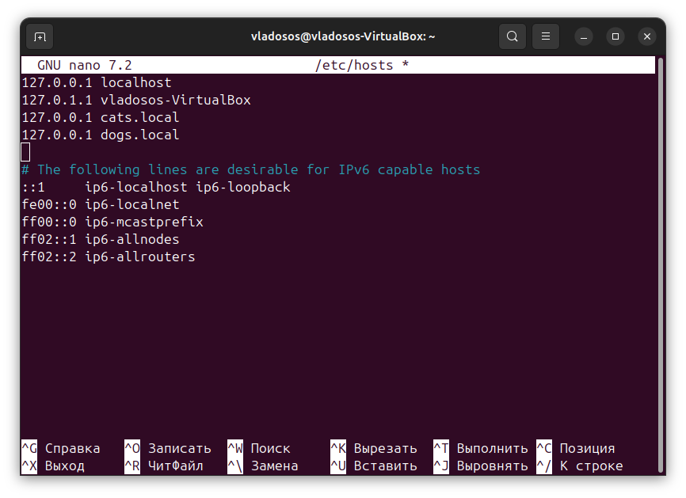

* Сохраним и закроем
* Далее введём в строку браузера последовательно следующие коды:
```
http://cats.local
```
```
http://dogs.local
```
Если всё прошло успешно, тогда будет видно следующее: 

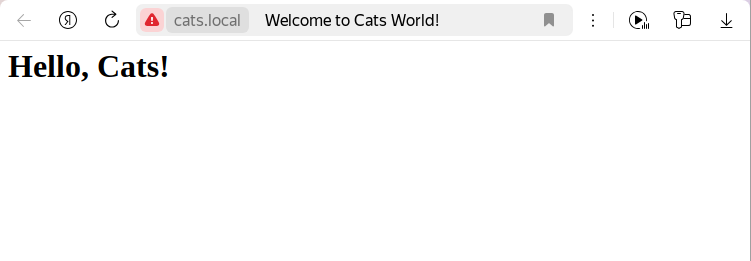 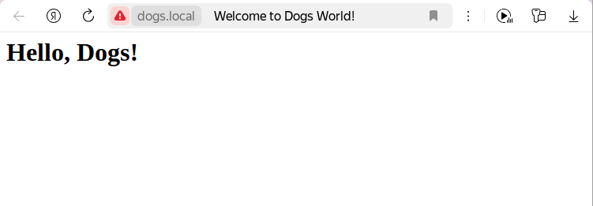

Как можно понять - наши сервер соединяется с сайтами по протоколу http, что видно по значку опасного подключения.

## Настройка HTTPS и перенаправления HTTP на HTTPS

Что это такое?
HTTPS обеспечивает безопасное соединение между браузером и сервером. Мы настроим HTTPS с использованием самоподписанных SSL-сертификатов и перенаправим все HTTP-запросы на HTTPS.

### Устанавливаем OpenSSL 

```
sudo apt-get install openssl
```

### Создаём SSL-сертификаты и ключи

* Для `cats.local`
```
sudo openssl req -x509 -nodes -days 365 -newkey rsa:2048 \
  -keyout /etc/ssl/private/cats.key \
  -out /etc/ssl/certs/cats.crt
```
В качестве результата будет красивая змейка и дальше терминал попросит указать данные для статитстики, их можно указать нарандоме, это не влияет на работу

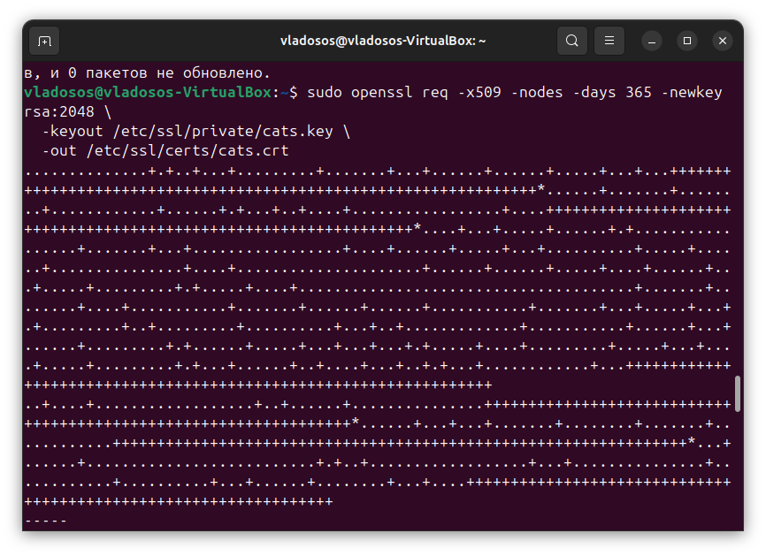

* Для `dogs.local`
```
sudo openssl req -x509 -nodes -days 365 -newkey rsa:2048 \
  -keyout /etc/ssl/private/dogs.key \
  -out /etc/ssl/certs/dogs.crt
```
На картинке - пример запуска ssl сертификата

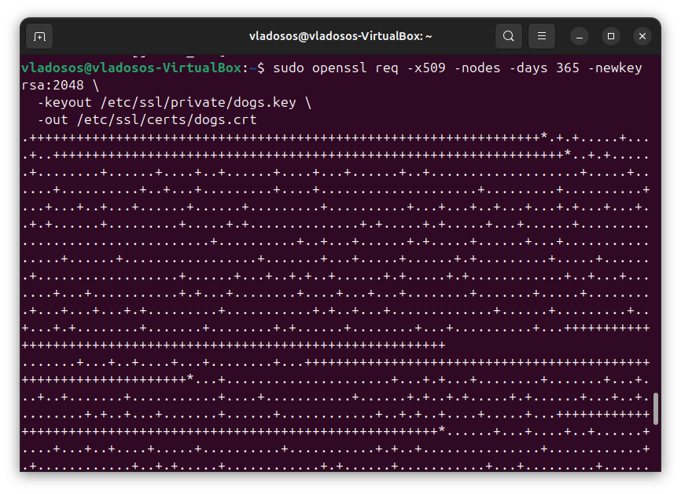

### Обновляем конфигурации для HTTPS:
* Для `cats.local`:
```
sudo nano /etc/nginx/sites-available/cats.conf
```
Обновляем конфигурацию
```
server {
    listen 80;
    server_name cats.local;
    return 301 https://$host$request_uri;
}

server {
    listen 443 ssl;
    server_name cats.local;

    ssl_certificate /etc/ssl/certs/cats.crt;
    ssl_certificate_key /etc/ssl/private/cats.key;

    root /var/www/cats/html;
    index index.html;

    location / {
        try_files $uri $uri/ =404;
    }
}
```
* Для `dogs.local`
```
sudo nano /etc/nginx/sites-available/dogs.conf
```
Обновляем конфигурацию

```
server {
    listen 80;
    server_name dogs.local;
    return 301 https://$host$request_uri;
}

server {
    listen 443 ssl;
    server_name dogs.local;

    ssl_certificate /etc/ssl/certs/dogs.crt;
    ssl_certificate_key /etc/ssl/private/dogs.key;

    root /var/www/dogs/html;
    index index.html;

    location / {
        try_files $uri $uri/ =404;
    }
}
```
### Проверяем конфигурацию
```
sudo nginx -t
```
### Перезапускаем Nginx:
```
sudo systemctl restart nginx
```
### Проверяем работу

Для этого введём в поисковую строку браузера

* `http://cats.local` (должно перенаправить на `https://cats.local`).
* `http://dogs.local` (должно перенаправить на `https://dogs.local`).

Результат должен выглядеть следующим образом:

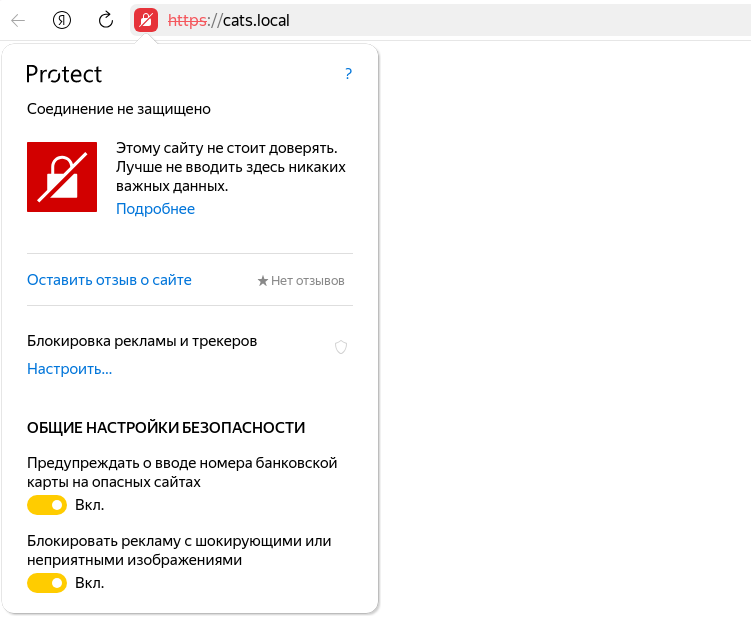

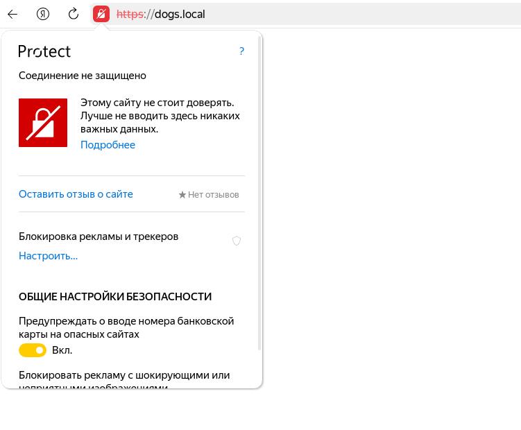

## Настройка псевдонимов (alias)

Псевдонимы (alias) позволяют сокращать пути к файлам. Например, вместо `/var/www/cats/html/images/cat.jpg` можно использовать `/images/cat.jpg`.

Далее пойдёт ход работ по настройке и по тому что нужно сделать 
### Создать дополнительные директории и файлы:
* Для `cats.local`:
```
sudo mkdir -p /var/www/cats/html/images
echo "<h1>Happy Cat!</h1>" | sudo tee /var/www/cats/html/images/happy.html
```
* Для `dogs.local`:
```
sudo mkdir -p /var/www/dogs/html/images
echo "<h1>Happy Dog!</h1>" | sudo tee /var/www/dogs/html/images/happy.html
```
### Добавить псевдонимы в конфигурации
* Для `cats.local`:
```
sudo nano /etc/nginx/sites-available/cats.conf
```
Добавить:
```
location /catimages {
    alias /var/www/cats/html/images;
}
```
Выглядеть конфиг после всех манипуляций будет следующим образом: 

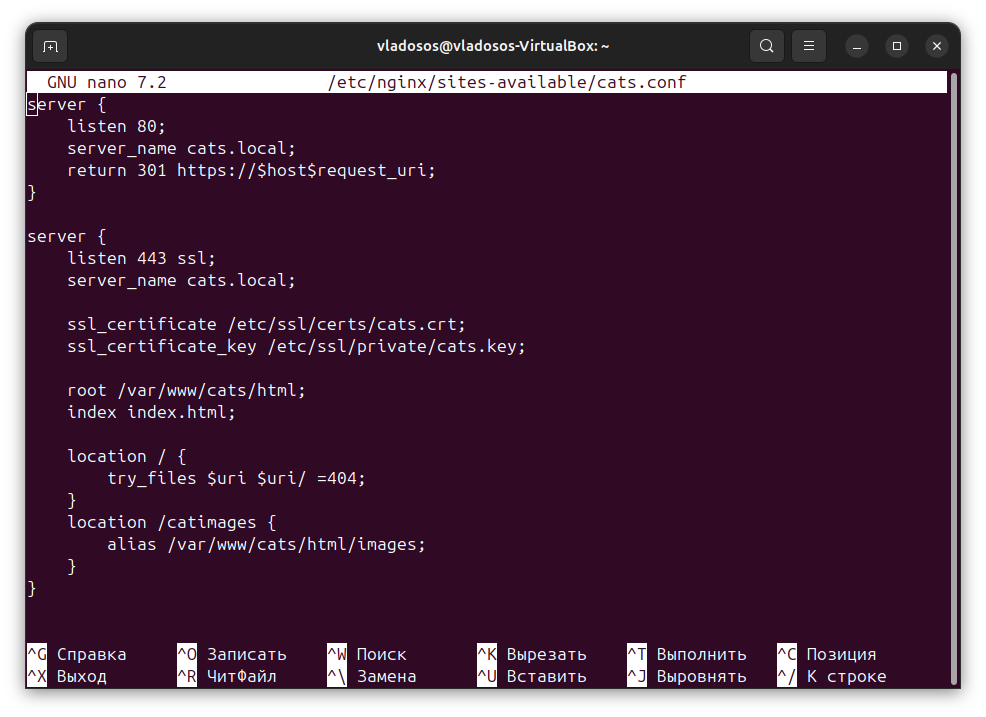

* Для `dogs.local`:
```
sudo nano /etc/nginx/sites-available/dogs.conf
```
Добавляем: 
```
location /catimages {
    alias /var/www/cats/html/images;
}
```

Итоговый код в конфиге: 

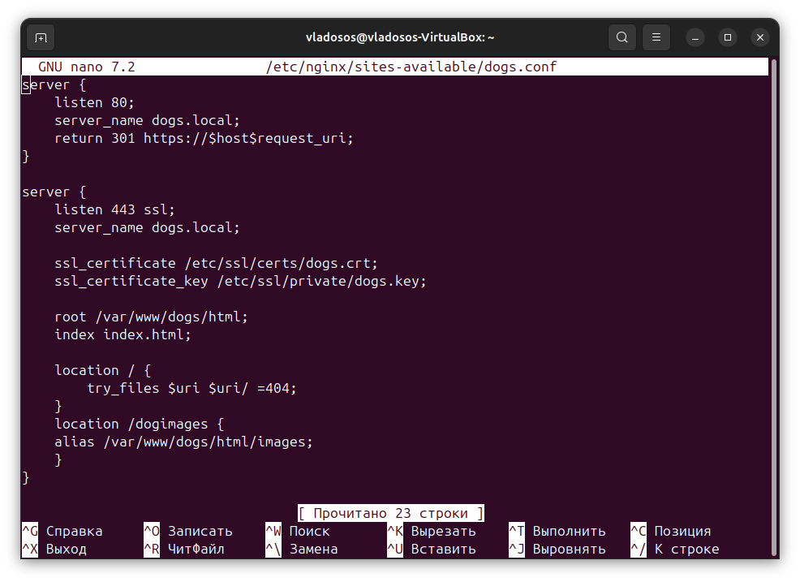

### Проверить конфигурацию:

```
sudo nginx -t
```

### Перезапустить Nginx:

```
sudo systemctl restart nginx
```

### Проверить работу:

Откройте в браузере:

* `https://cats.local/catimages/happy.html`
* `https://dogs.local/dogimages/happy.html`

Так как успешный успех не обошёл меня стороной, то получилось следующее: 

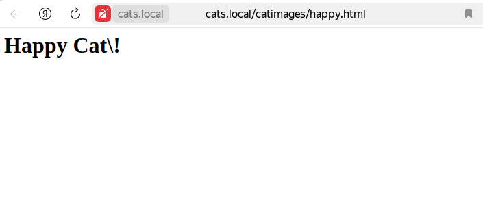

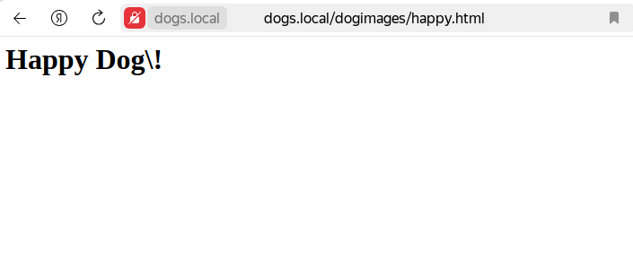

## Подведём итоги

1. Были настроены виртуальные хосты для cats.local и dogs.local.
2. Добавлены локальные домены в файл /etc/hosts.
3. Настроены HTTPS с самоподписанными сертификатами и перенаправление с HTTP на HTTPS.
4. Созданы псевдонимы для упрощения доступа к файлам
5. Я красиво поработал :)


