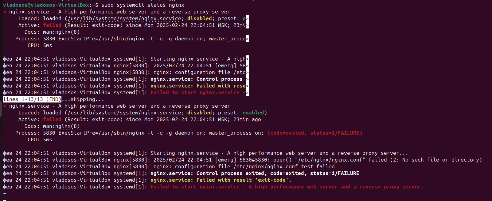

# Лабораторная работа №1
Выполнил студент Зюзин Владислав Александрович К3220
## Задания:

Настроить nginx по заданному тз:
1. Должен работать по https c сертификатом
2. Настроить принудительное перенаправление HTTP-запросов (порт 80) на HTTPS (порт 443) для обеспечения безопасного соединения.
3. Использовать alias для создания псевдонимов путей к файлам или каталогам на сервере.
4. Настроить виртуальные хосты для обслуживания нескольких доменных имен на одном сервере.

## Подготовка к работе, траблы в начале
Перед началом уточню, работа происходмла на ядре ОС Linux **`Ubuntu 24.04 LTS`**. 

* Открываем терминал и при помощи команды `sudo apt-get install nginx` устанавливаем NGINX.  
* Если нас просят продолжить - соглашаемся.  
* NGINX установлен!  
* После установки проверяем статус работы NGINX при помощи команды `sudo systemctl status nginx`.

**Есть важное уточнение** если вы рискнули здоровьем и когда-либо раньше пытались работать с nginx-ом, то у вас может возникнуть такая проблема: 

### Шаги и решения для преодоления этой преграды: 
1. Скорее всего у вас нет конфига, мб вы его случайно удалили, как в моём случае. Для этого нужно ввести в терминал код: `ls -l /etc/nginx/nginx.conf`. Если линукс не находит файла и каталога, то читаем далее
2. Для профилактики этой проблемы тренируем свои кривые руки и внимание :)
3. После этого пишем код `sudo apt-get remove --purge nginx nginx-common nginx-core`, он снесёт nginx, применяйте его в том случае, если у вас нет важных проектов.
4. Далее: заново скачиваем nginx с помощью кода - `sudo apt-get install nginx`.
5. Вводим `sudo nginx -t` - так мы проверим корректен ли синтакис и сам конфиг, если видим, что тексты пройдены и конфиг succesful - тогда испытываем радость
6. `sudo systemctl start nginx` этим кодом закпускаем nginx
7. `sudo systemctl status nginx` - проверяем статус работы. Если всё горит зелёным и статус активен, то проблема решена

### Проверка работы nginx 
1. Для того, чтобы понять, что более косков допущено не было нам нужно узнать работает ли ваш nginx в браузере.
2. Вводим код `hostname -I`, чтобы узнать свой локальный IP адрес, в моём случае - это первые 4 значения.
3. Вводим эти занчения в браузер, успех будет достигнут, если вы увидете следующее: 

